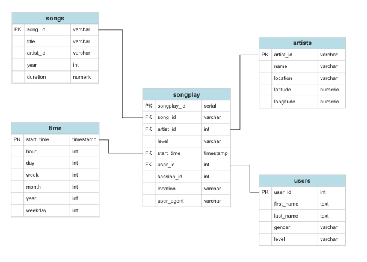

# SPARKIFY SCHEMA ETL SCRIPTS

Set of python scripts to create a star-schema and run queries with songplay analysis in mind. 

With a star-schema in place a lot of aggregations can be made on data such as number of songs played per user or most played artists during last_week.

Through simplified queries Sparkify can create smart dashboards on the fly on current trends of users and artists or songs rankings to name a few examples.

## ONE SOURCE OF TRUTH

For analysis on songplay purposes this structure leads to fast grasping of insights and trends without worrying on data integrity or redudancy of query results. 

### ERD

## REQUIREMENTS

The schema is generated from two types of source files: **Song Data** and **Log Data** 

These must be in json format. The ETL pipeline is robust to handle various files within a directory and other sub directories.

>> ie. SONG_DATA_FILEPATH = data/song_data

## CONTENT

- sql_queries.py 
All SQL commands to create, insert and drop tables.

- create_tables.py
Functions to generate database and connect to Sparkify database plus create schema calling sql_queries.py commands.

- etl.py
Read data, process and transform, and load into corresponding tables functions. 

- data
Directory with sample song data and meta-data log data.

## RUN

**Must run creates_tables.py first in order to create sparkifydb database and its schema** The tables and sql commands are defined in the sql_queries python script.

Run etl.py to load data into schema.

That's all you need! You are ready to build your own queries script. 

EXAMPLE QUERIES
---------------

-  Top 5 listeners
>>    first_name	count
            Chloe	703
            Tegan	665
            Kate	557
            Lily	521
            Aleena	397

- Most played time of the day
>>        hour	count
            16	541
            18	497
            17	493
            15	477
            14	43

## REFERENCES

Special acknowledgement to Haki Benita for the execute_batch guide on how to do bulk insert.
[I'm an inline-style link](https://hakibenita.com/fast-load-data-python-postgresql)

