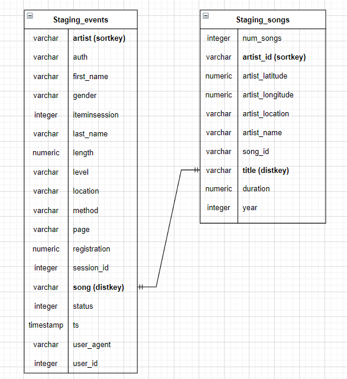

# SPARKIFY Data Warehouse on the cloud using Redshift, EC2 and S3.

Set of python scripts to create a star-schema analytical tables withing Redshift and run queries with songplay analysis in mind by having load data from s3 into staging tables in Redshift to improve performance and have a reliable, scalable and worry-free storage solution.

By having both staging tables and analytical tables we can load large amounts of data with high efficiency and still be able to contain a star-schema in place to do lots of aggregations on data such as number of songs played per user or most played artists during certain a time period. 

Through simplified queries Sparkify can create smart dashboards on the fly on current trends of users and artists or songs rankings to name a few examples.

## ONE SOURCE OF TRUTH

For analysis on songplay purposes this structure leads to fast grasping of insights and trends without worrying on data integrity or redudancy of query results. 

### ERD

## REQUIREMENTS

The schema is generated from two types of source files: **Song Data** and **Log Data**. 

These must be in json format. 

The ETL pipeline uses a TCP port in ec2 to issue copy commands that will read partitioned files on s3 to the staging_events and staging_songs tables available on a Redshift cluster through AWS.

In the loading process we specify for the **staging_events** table the json_file_path and the timeformat for our timestamp column. This helps load the right data from the json files and avoid transforming the timestamp values on the insert commands when loading from staging to our analytical tables.

For the **staging_songs** table load we specify in the copy commands the 'auto' option to read jsons since a json_file_path is not necessary.
We have to specify the region us-west-2 to reach our s3 bucket **udacity-dend**.

>> LOG_DATA='s3://udacity-dend/log_data'

>> LOG_JSONPATH='s3://udacity-dend/log_json_path.json'

>> SONG_DATA='s3://udacity-dend/song_data'

## CONTENT

- sql_queries.py 
All SQL commands to create, insert and drop tables.

- create_tables.py
Functions to connect to Sparkify's dwh on Redshift database plus create staging and star schema tables calling sql_queries.py commands.

- etl.py
Read data from s3, transform, and load into corresponding tables functions all within AWS. 

- redshift_cluster.ipynb
Code to use IAC to create a Redshift cluster and its corresponding IAM role.

## RUN

A prequesite is to have the Redshift cluster available in the us-west-2 region. Make sure you update the dwh.cfg file with your AWS keys or if already running a cluster copy the cluster endpoint and the arn role to the config file. Is worth mentioning that all config variables under CLUSTER, IAM ROLE AND S3 must be updated int he congif file independent of your choice to use the redshift_cluster.ipynb script to create a cluster.

#### ETL process 
**Must run creates_tables.py first in order to create dwh database and the required staging and analytical tables**. The tables and sql commands are defined in the sql_queries python script.

Run etl.py to load data into our tables. Staging tables are loaded with copy commands using a ec2 TCP port while analytical tables are loaded through sql queries within the tables already hosted in the Sparkify dwh database.

That's all you need! You are ready to build your own queries script. 

EXAMPLE QUERIES
---------------

-  Top 5 listeners
>>     first_name	count
            Chloe	703
            Tegan	665
            Kate	557
            Lily	521
            Aleena	397

- Most played time of the day
>>        hour	count
            16	541
            18	497
            17	493
            15	477
            14	43
