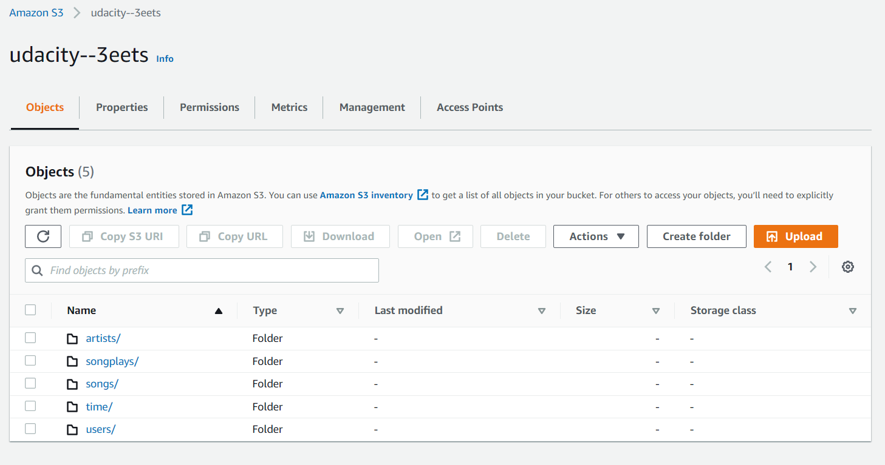

# SPARKIFY's DataLake: Processing with an AWS EMR cluster and S3 storage.

### Introduction

For Sparkify to have a more easy way to load different file types and in this case do schema on read of raw data creating a data lake will avoid creating databases for loading data. In this repository we have an etl pyspark script that can run inside an EMR cluster to extract data, process and load fact and dimensions tables back to s3 for analysis. Analytic teams can run queries with songplay analysis in mind on these tables while reducing costs of processing data on the cloud while keeping processing performance or not reducing it by much. 

By using s3 we can save tables in different formats and not necessarily in HDFS and store data in the cluster. This cost efficient solution to our etl process will still allow us to keep a star-schema in place, to do lots of aggregations on data such as number of songs played per user or most played artists during certain a time period. 

Through simplified queries Sparkify can create smart dashboards on the fly on current trends of users and artists or songs rankings to name a few examples.

## ONE SOURCE OF TRUTH

For analysis on songplay purposes this structure leads to fast grasping of insights and trends without worrying on data integrity or redudancy of query results. 

### RESULT

## REQUIREMENTS

The schema is generated from two types of source files: **Song Data** and **Log Data**. 

#### S3 datasets 

>> LOG_DATA='s3://udacity-dend/log_data'

>> SONG_DATA='s3://udacity-dend/song_data'

These are located in a s3 bucket in the us-west-2 region and both in json format. Address: **"s3a://udacity-dend/"**

To run the etl.py script we will run an EMR cluster on AWS with the following specs:
> aws emr create-cluster --name DataLakeSparkify --use-default-roles --release-label emr-5.28.0 --instance-count 3 --applications Name=Spark Name=Hadoop --ec2-attributes KeyName=pemfile,SubnetId=subnet --instance-type m5.xlarge --profile default

The SubnetId as long as the key pair and the profile should be configure in the same region as our raw data bucket which is us-west-2.
To configure your profile from the AWS CLI you can use:
> aws configure set region us-west-2 --profile default

You might also want to generate a default vpc from the CLI
> aws ec2 create-default-vpc --profile default

## EMR CLUSTER 
### Security Group

To continue using the CLI and SSH we want to have our master node authorize inbound traffic from your local IP address through port 22.
You can access the security group of the master node in the AWS console once the cluster has started by selecting the new cluster from the EMR dashboard.

### Setting up the Spark UI

To review the job through the Spark UI you will need to use scp and ssh as follows:

> scp -i pemfile pemfile hadoop@**master-node-public-dns**:/home/hadoop/

> ssh -i pemfile -N -D 8157 hadoop@**master-node-public-dns**

With the Proxy SwitchyOmega extension you can add a new PAC profile with this script to access the SaprkUI

> function FindProxyForURL(url, host) {
 if (shExpMatch(url, "*ec2*.amazonaws.com*")) return 'SOCKS5 localhost:8157';
 if (shExpMatch(url, "*ec2*.compute*")) return 'SOCKS5 localhost:8157';
 if (shExpMatch(url, "http://10.*")) return 'SOCKS5 localhost:8157';
 if (shExpMatch(url, "*10*.compute*")) return 'SOCKS5 localhost:8157';
 if (shExpMatch(url, "*10*.amazonaws.com*")) return 'SOCKS5 localhost:8157';
 if (shExpMatch(url, "*.compute.internal*")) return 'SOCKS5 localhost:8157';
 if (shExpMatch(url, "*ec2.internal*")) return 'SOCKS5 localhost:8157';
 return 'DIRECT';
}

Once you have enabled the profile through the extension you can access the UI on a new browser tab.

> http://**master-node-public-dns**:18080/

### Loading files to Hadoop

To access the cluster from a terminal you can use the command:

> ssh -i pemfile hadoop@**master-node-public-dns**

Upload the config file to the hadoop node with your aws access key and secret from the terminal to the home directory in hadoop.
> scp -i pemfile dl.cfg hadoop@**master-node-public-dns**:/home/hadoop/

Now, the ETL script to our hadoop node
> scp -i pemfile etl.py hadoop@**master-node-public-dns**:/home/hadoop/

### RUN

A prequesite is to have the EMR cluster available in the us-west-2 region.

Inside the hadoop node now you can run etl.py with spark submit.

> /usr/bin/spark-submit --master yarn ./etl.py

## CONTENT
- etl.py
Read/extract data from s3, transform, and load back into S3 into corresponding fact and dimensions tables following Sparkify's star schema. All tables stored in S3 for analysis will be saved in the parquet format.
- dl.cfg
Config file with AWS_ACCESS_KEY_ID and AWS_SECRET_ACCESS_KEY of a AWS user with permissions to read and write on s3. 

## OUTPUT

All tables will be stored in a s3 bucket in the us-west-2 region. The bucket address is "s3a://udacity--3eets/". Once the cluster has finished processing the etl.py pyspark script the bucket will have 5 directories: songs, artist, users, time and songplays.

### S3 bucket

"artist" and "users" data is not partitioned, "songs" is partioned by **year** and **artist_id** and "time" and "songplays" data is partitioned by **year** and **month**.

## TERMINATE CLUSTER

Since data is saved in s3 it is safe to terminate the EMR cluster and a must to avoid extra charges to Sparkify's AWS account.

